# grafana-cloud-org-insights

[](https://scorecard.dev/viewer/?uri=github.com/rknightion/grafana-cloud-org-insights)

Estate-wide insight for a large Grafana Cloud organisation. A collector scans every stack in the org on
a schedule, transforms what it finds, and publishes it as ordinary Grafana dashboards on one stack you
nominate.

It exists because past a couple of dozen stacks nobody can answer simple questions any more. Which
stacks cost the most and why. Who has admin on what. What is provisioned but has no observed use in the measured window. Which stacks
are on last quarter's build. Answering those by hand, stack by stack, is a day's work that goes stale
the moment it finishes.

Two audiences, two cadences. A platform team reads it weekly and wants to know who is struggling, who
is over-alerting and who needs help. Leadership reads it quarterly and wants to know whether the spend
is defensible and whether adoption is growing.

## What it is not

- Not a replacement for showback. If your org already emails per-owner cost reports, this answers "which
 lever moves that number", not "what did it cost".
- Not an agent on your stacks. Nothing is installed anywhere. The collector runs in your AWS account and
 talks to `grafana.com` and to each stack's own API over HTTPS.
- Not a write path. The scanning credential is read-only by scope, and the collector's HTTP client
 refuses any method other than GET. Publishing uses a second credential whose realm is a single stack.

## How it works

Four scheduled scan tiers plus a provisioner, all ECS Fargate tasks on EventBridge schedules. The estate is discovered afresh on each run.

| | Cadence | Gathers |
|---|---|---|
| T1 | hourly | org inventory, access policies, org members and Fleet Management |
| T2 | daily | per-stack users, plugins, service accounts, Assistant, usage insights, public dashboards, alert routing, Loki retention, signal labels and capability adoption |
| T3 | every 6h | the data plane: cardinality and Adaptive Metrics rules/recommendations |
| T4 | daily | the estate diff, two windows: 7 days and 1 day |
| provisioner | daily | reconciles one read-only service account per stack |

Three landing zones, each chosen for what it is good at:

- **Mimir** takes bounded metrics, for trends and alerting. Labels carry `stack`, `region` and fixed
 enums only.
- **Loki** takes finding detail. Identity-bearing fields such as dashboard uids and user logins
 require deployment acceptance and controls for minimisation, access, encryption and retention; they
 never become metric labels.
- **S3** takes pre-shaped tables the dashboards render directly, plus a raw scan archive for the diff
 and for audit. Long-term history lives in Mimir, not in the archive.

Every tier composes the full view set from the full input set, hydrating whatever it did not gather
itself from the other tiers' latest scans. A view whose inputs are unsatisfied is withheld rather than
written as zeros, so a table that stops advancing is the signal that something upstream has stopped.

## What you can observe

The eleven dashboards answer different questions. The source and window matter: configured inventory,
telemetry production and human activity are different observations. Scan-fed dashboards include
measured-population and input-age context; a missing value is not a measured zero. Each image below
is a reviewed screenshot from the robknight development stack, rendered over a 24-hour range.

### Estate

| Question it answers | Source | Cadence or window | Fidelity |
|---|---|---|---|
| Which stacks exist and what changed? | Org inventory and scan history | Hourly inventory; daily 1-day and 7-day diff | Configured |

[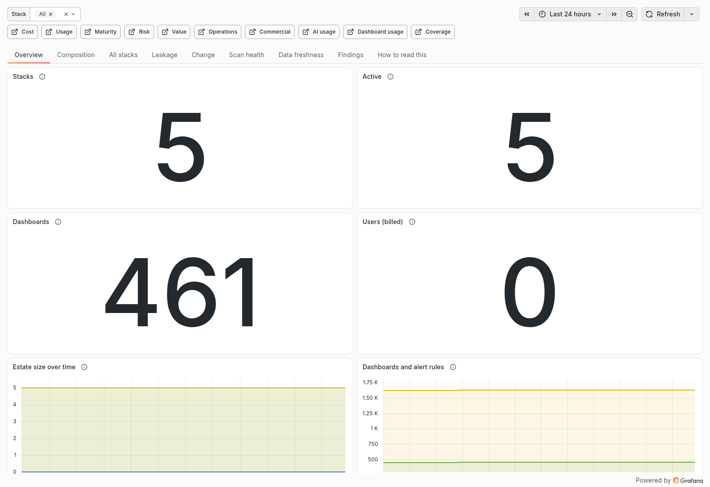](docs/dashboards.md#estate)

### Cost

| Question it answers | Source | Cadence or window | Fidelity |
|---|---|---|---|
| Which stacks and signals drive cost, and where can rules reduce it? | Collector, Adaptive Metrics and Logs, billing datasource | 6-hour data plane; daily Logs; live billing period | Producing and configured |

[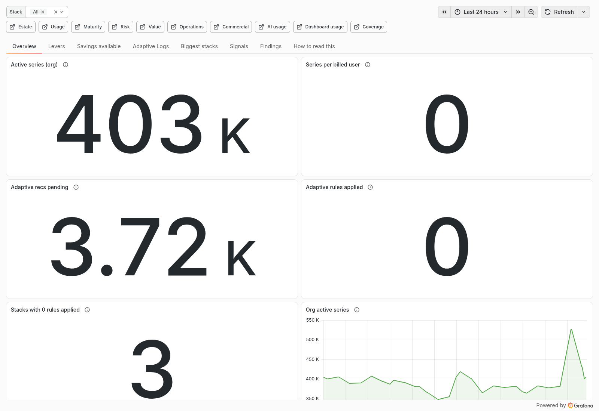](docs/dashboards.md#cost)

### Usage

| Question it answers | Source | Cadence or window | Fidelity |
|---|---|---|---|
| Which capabilities and datasources are configured or producing telemetry? | Stack inventory and signal measurements | Daily inventory; 24-hour signal windows where labelled | Configured and producing |

[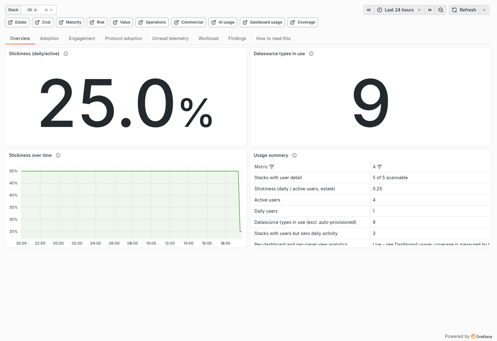](docs/dashboards.md#usage)

### Maturity

| Question it answers | Source | Cadence or window | Fidelity |
|---|---|---|---|
| How does each measured stack score, and why? | Collector inventory and data plane | Daily and 6-hour inputs | Configured and producing |

[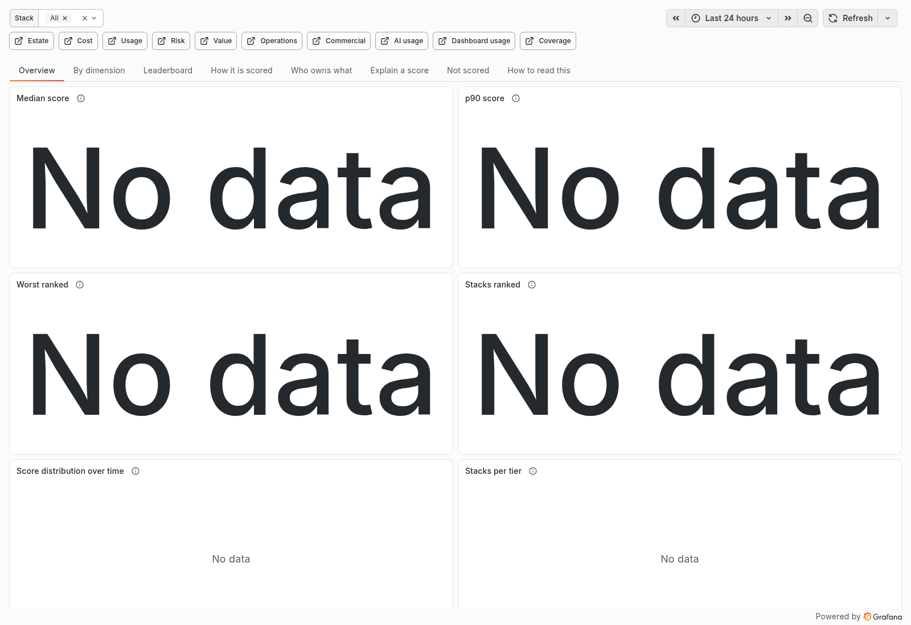](docs/dashboards.md#maturity)

### Risk

| Question it answers | Source | Cadence or window | Fidelity |
|---|---|---|---|
| Where are access, routing, retention and public-share risks? | Org, stack and signal inventories | Hourly, daily and 6-hour inputs | Configured; public opens are used |

[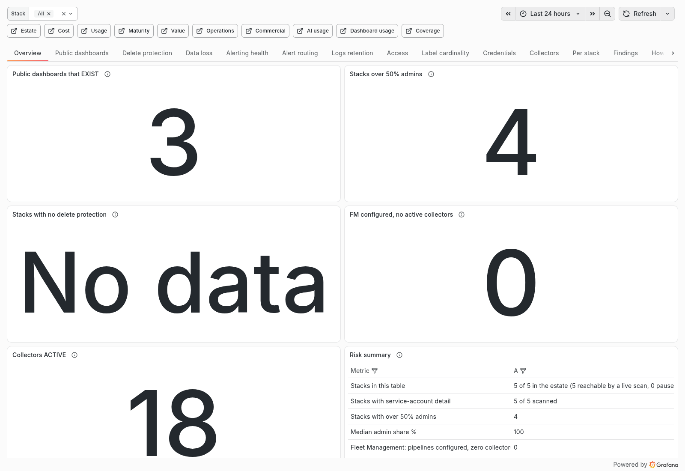](docs/dashboards.md#risk)

### Value

| Question it answers | Source | Cadence or window | Fidelity |
|---|---|---|---|
| What savings and capability gaps can be evidenced? | Collector and optional rate card | Daily and 6-hour inputs | Configured and producing |

[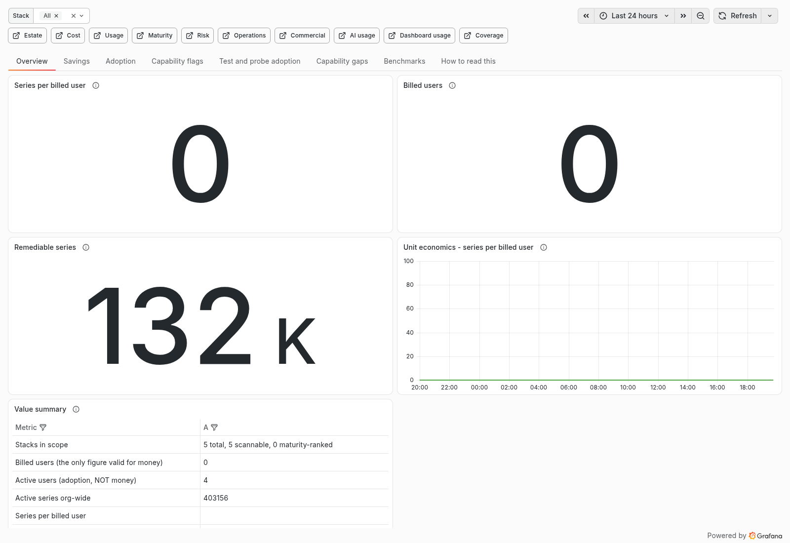](docs/dashboards.md#value)

### Operations

| Question it answers | Source | Cadence or window | Fidelity |
|---|---|---|---|
| Are OnCall alerts acknowledged and owned? | Live `grafanacloud-usage` | Billing datasource; 24-hour windows for rates | Producing and recorded response |

[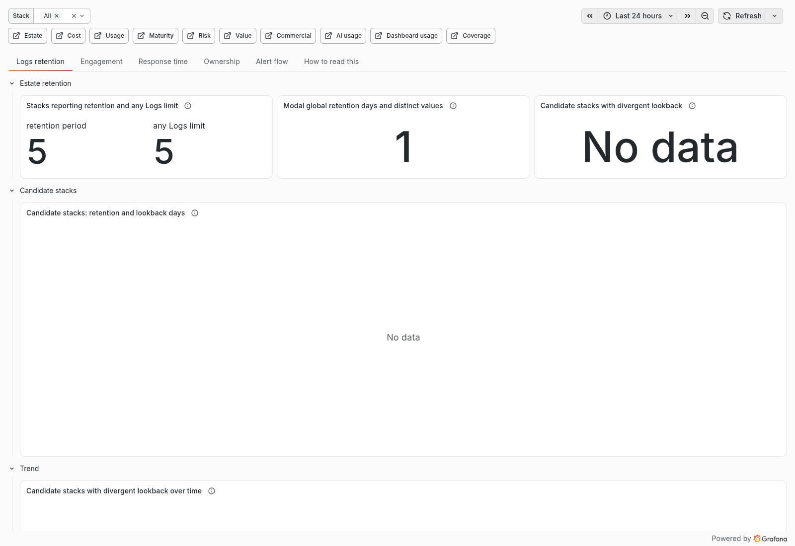](docs/dashboards.md#operations)

### Commercial

| Question it answers | Source | Cadence or window | Fidelity |
|---|---|---|---|
| How do current run rate and commitment compare? | Live `grafanacloud-usage` | Current billing period | Billed consumption |

[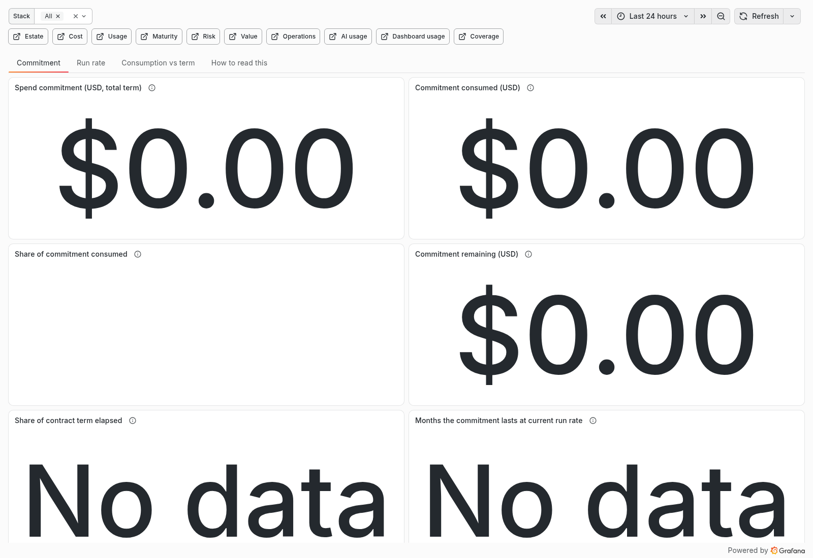](docs/dashboards.md#commercial)

### AI usage

| Question it answers | Source | Cadence or window | Fidelity |
|---|---|---|---|
| Where is Assistant enabled and reporting use? | Live billing datasource and daily Assistant read | Billing period and rolling 30-day plugin window | Configured and reported use |

[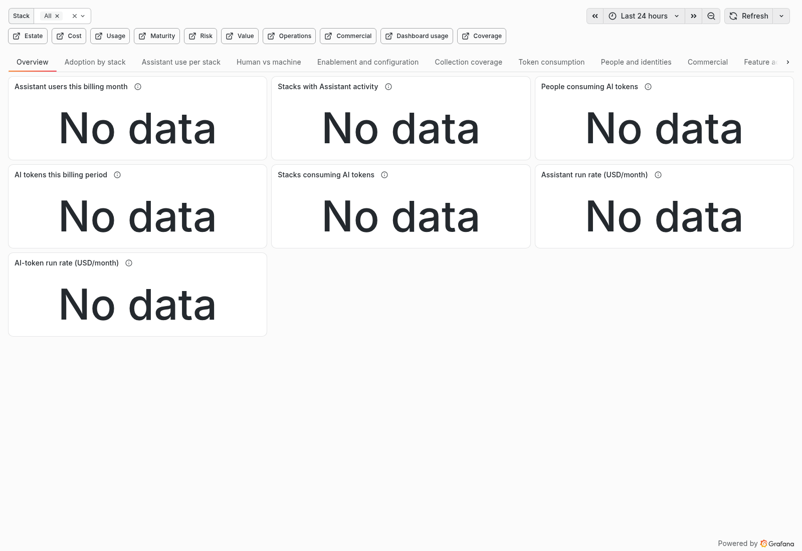](docs/dashboards.md#ai-usage)

### Dashboard usage

| Question it answers | Source | Cadence or window | Fidelity |
|---|---|---|---|
| Which dashboards were opened and what did panels query? | Per-stack `grafanacloud-usage-insights` | Daily sweep of a rolling 24-hour window | Used by people and panel requests |

[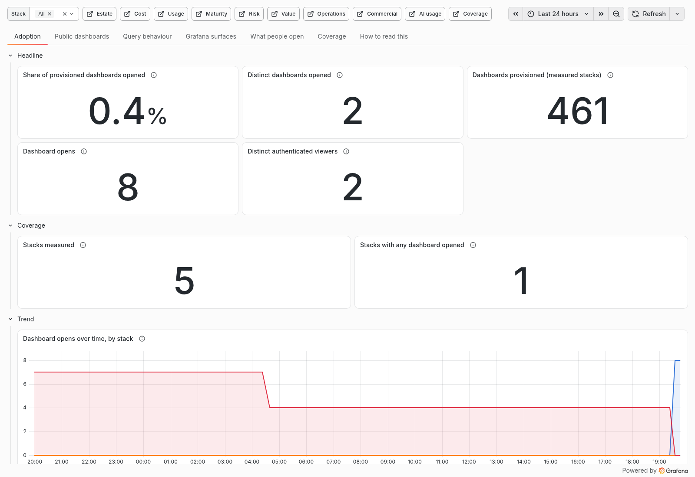](docs/dashboards.md#dashboard-usage)

### Coverage

| Question it answers | Source | Cadence or window | Fidelity |
|---|---|---|---|
| Which services, technologies and infrastructure are observed? | Signal labels, stack inventory, S3 registers and live billing datasource | Daily sweep; explicit signal windows; live 24-hour panels | Producing, with configured context |

[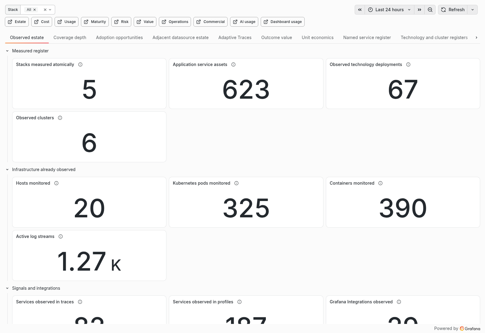](docs/dashboards.md#coverage)

Two of them - `operations` and `commercial` - are panels only. They read `grafanacloud-usage`, a
Prometheus datasource already provisioned on every Grafana Cloud stack, so those panels need no collector collection, credential or emitted series. If data is already a
datasource on the target stack, a panel can present it directly.

The `dashboards` surface is Pillar J. It reads each stack's own
`grafanacloud-usage-insights` datasource through that stack's datasource proxy, with a basic-role-None
reader whose query permission is scoped to that datasource uid. It measures what people open and which
datasources panels actually query. The Risk dashboard independently enumerates configured public
dashboards, because usage events cannot see a share nobody opens.

## What it cannot see

- Provisioned plugins, datasources, dashboards and capabilities do not prove anyone uses them. A
  produced signal proves ingest or requests, not a person's intent or business value.
- Usage insights records dashboard opens and panel data requests. A page visit without a request is
  invisible. A `source` value counts requests, not visits; the generic `scenes` bucket cannot identify
  individual Scenes apps. Panel-editor requests are suppressed upstream. Explore and correlation
  errors are not reliably populated.
- Distinct viewers summed across stacks are not distinct people across the org. Anonymous opens have
  no person identity. Assistant tenant inventory cannot see user-scoped skills or rules, and its
  billing and plugin windows are different.
- A missing series can mean no telemetry, an unavailable reader, an unmeasured stack or a stale input.
  Read each panel's denominator and freshness before treating absence as a finding. Currency is absent
  when no complete price basis exists.
- The platform does not measure application business outcomes or prove that a configured alert was
  seen by a human. OnCall response panels report recorded acknowledgements and their measured
  population; they do not infer attention from a missing timing event.

## Running a scan

```bash
export GCINSIGHT_READ_TOKEN=... # access policy token, org realm, the read scopes in config.READER_SCOPES
export GCINSIGHT_ORG_ID=... # the org to scan
export GCINSIGHT_WRITE_STACK=... # the ONE stack results are published to
export GCINSIGHT_MIMIR_URL=... # https://prometheus-prod-NN-<region>.grafana.net
export GCINSIGHT_MIMIR_TENANT=... # the write stack's hmInstancePromId
export GCINSIGHT_LOKI_URL=... # https://logs-prod-NNN.grafana.net
export GCINSIGHT_LOKI_TENANT=... # the write stack's hlInstanceId
export GCINSIGHT_S3_BUCKET=...
export GCINSIGHT_STACK_TOKEN_PREFIX=/gcinsight/stack-token # per-stack reader tokens in SSM

./scan.py --tier t1 --dry-run # inventory only, prints the meta block and writes nothing
./scan.py --tier t1
./scan.py --tier t2 --limit 6 --dry-run # bounded diagnostic; publishing a subset is refused
./scan.py --tier t3
./scan.py --tier t4 # reads S3 only, makes no API calls
./scan.py --tier t2 --stack <slug> --dry-run # one-stack diagnostic
```

None of those have defaults. A default org id or tenant would be one deployment's identifiers baked
into everyone else's collector, and the failure is silent rather than loud: the scan authenticates,
succeeds, and writes a plausible set of series into somebody else's tenant.

`GCINSIGHT_WRITE_TOKEN` publishes and falls back to the read token when unset, so a single-credential
interactive run works. A deployment sets both, and the write token's realm should be the write stack
alone. The daily provisioner uses a third org-realm token with only `stacks:read` and
`stack-service-accounts:write`; the collector never receives it.

Exit codes: `0` fine, `1` scan coverage or owner-input health below the publication floor, `2` configuration or unsafe publication, `3` gathering succeeded but publication failed, `4` lock collision. `3` is separate on purpose - "the estate is unreachable" and
"we cannot write to the target stack" need different responses.

## Building the dashboards

The dashboard builder needs the published views, because Infinity's backend parser needs an explicit
column spec and an empty one returns HTTP 500 for the whole panel. It reads them from S3, or from a
local directory:

The shipped dashboards do not require third-party panel plugins. If you adopt panels that use them,
these are the minimum versions verified as Grafana 13.3 compatible from their installed manifests:

| Plugin ID | Minimum verified version |
|---|---:|
| `volkovlabs-echarts-panel` | 7.2.5 |
| `volkovlabs-table-panel` | 3.6.5 |
| `volkovlabs-variable-panel` | 5.2.0 |
| `marcusolsson-treemap-panel` | 2.1.1 |

They remain optional unless an adopted panel requires one of them.

```bash
./bin/make_local_views.py # compose views from the committed fixture
export GCINSIGHT_VIEWS_DIR=testdata/views
export GCINSIGHT_WRITE_STACK_URL=https://<slug>.grafana.net
export GCINSIGHT_WRITE_STACK_ID=<numeric-stack-id>
export GCINSIGHT_GRAFANA_TOKEN=<short-lived-build-token>
python3 bin/dashboards.py --publish all
```

That local path is how the test suite runs, and it is the quickest way to see what a dashboard looks
like before anything is provisioned.

## Deploying it

`terraform/` is a reusable module with no provider block: ECS Fargate, one EventBridge schedule per
tier, S3, IAM, and a Secrets Manager container for the credentials.
`terraform/examples/standalone/` is the copy-and-edit root. Read `terraform/README.md` for the
first-deployment order, because doing those steps out of sequence gives you four tasks an hour failing
to start.

```bash
just image --repo <ecr-uri> # build the image; ARM64, no Python dependencies
just publish-image --repo <ecr-uri> # confirm, then push immutable :sha-<commit>
python3 bin/alerts.py --list # the health alert rules and their routing
python3 bin/trace.py --live --context <gcx-context> # prove every headline reproduces from the raw scan
python3 bin/probe_usage_signals.py # re-measure the grafanacloud-usage panels; needs no credential
just check-tags # audit the cost-allocation tag; pass --fix to repair
```

Fargate pulls the image reference in its task definition at task start. A consumer pinned by digest requires a reviewed deployment change to move that reference.

For a customer deployment, use the immutable consumer contract in `consumer/`. The deployment repository
owns the manifest and customer values; this repository owns the schema, validation, build, execution,
upgrade tooling, and Terraform module. `consumer/ARCHITECTURE.md` explains the boundary and
`consumer/MIGRATION-RUNBOOK.md` gives the exact upgrade, provenance, deployment gate, and rollback flow.
Customer consumers pin both the module commit and image digest, so changing a candidate requires a
reviewed deployment change; it is not picked up merely because a tag moved.

### Public container image

Release and edge images are published to `ghcr.io/rknightion/grafana-cloud-org-insights` for both
`linux/amd64` and `linux/arm64`. Release tags are signed with Sigstore keyless signing and carry GitHub
build provenance plus SPDX and CycloneDX SBOMs. A deployment must resolve a reviewed tag to its immutable
manifest digest and pin the digest, for example:

```hcl
image = "ghcr.io/rknightion/grafana-cloud-org-insights@sha256:<reviewed-manifest-digest>"
```

The normal deployment pulls the public GHCR image anonymously and directly when its task subnets have
outbound registry access. Amazon ECR pull-through cache is an optional customer policy choice. ECR
supports GHCR as an upstream, but AWS requires an upstream credential in a same-account, same-region
Secrets Manager secret for that cache rule even when the source package is public. Its name must begin
with `ecr-pullthroughcache/`, and its value carries the GHCR username and personal access token. The
generic product does not create or own that credential. Whether the chosen reference is direct or
ECR-cached, the task definition must pin the reviewed manifest digest. Neither a moving tag nor a Git
push changes an existing task definition.

Alert rules are published **paused and unrouted**, and going live is a deliberate step that requires
naming a receiver. The write stack is a real stack whose notification policy may route hundreds of rules
that are not yours, some to production ticketing; a rule with no `notification_settings` inherits that
policy. `python3 bin/alerts.py --activate --receiver <contact point>`.

## Tests

```bash
just test
```

No AWS credentials, no network, no live estate. `testdata/` holds a synthetic estate and
`tests/fixtures/` a synthetic scan - see `testdata/README.md` for what that means and what it does not.

## Read next

- `SPEC.md` - the design: capability model, architecture, correlation traps, security posture.
- `docs/traps.md` - the API and dashboard behaviour that has cost real time. Read it before writing a
 panel, a PromQL expression or an Infinity query.
- `CAPABILITIES.md` - what an org-realm token reaches and what it does not, endpoint by endpoint.
- `RUNBOOK.md` - operating a deployment: rotation, rollback, teardown, and what to tell the org before
 the first scheduled scan.
- `consumer/ARCHITECTURE.md` - the generic-core/deployment-overlay ownership boundary.
- `consumer/MIGRATION-RUNBOOK.md` - immutable consumer upgrades, drift proof, provenance, deployment
 stopping conditions, and rollback.
- `BUDGET.md` - the declared metric catalogue and the series it costs, generated from
 `collector/emit/budget.py`.
- `IDEAS.md` - the insight menu the capability set draws from, including the ones measured and rejected.

## Licence

Apache 2.0.
